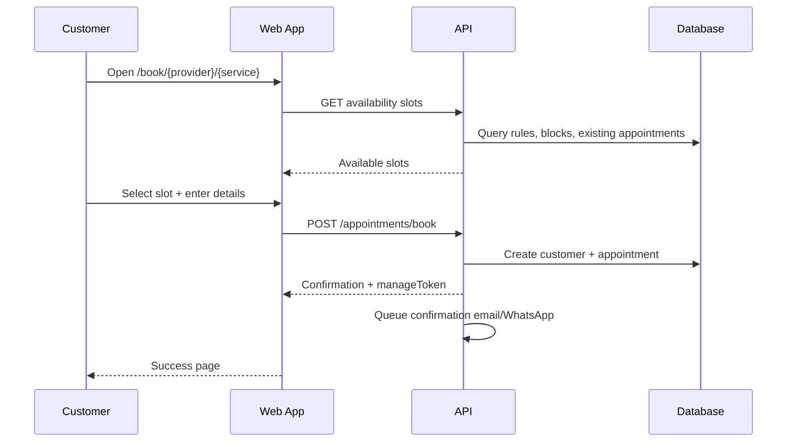
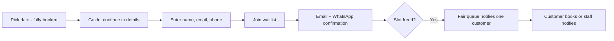
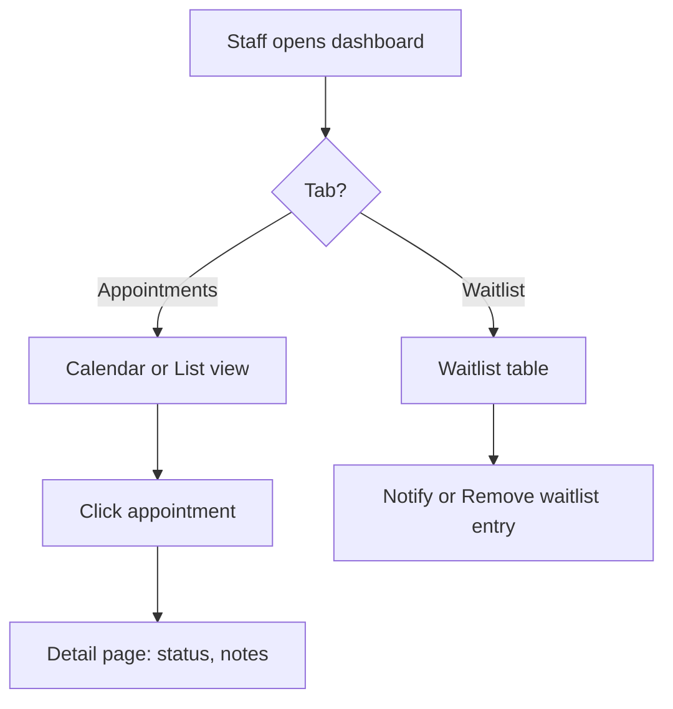
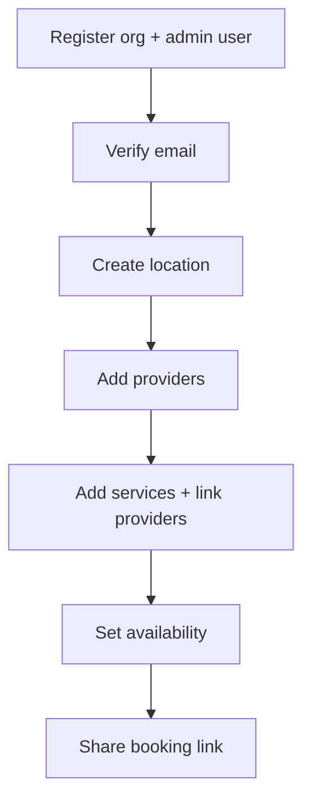

# Slotwise — Complete Project Documentation

**Product name:** Slotwise (Appointment Booking System)  
**Version:** 1.0.0 (monorepo)  
**Last updated:** May 2026

---

## Table of contents

1. [Executive summary](#1-executive-summary)
2. [Architecture overview](#2-architecture-overview)
3. [Repository structure](#3-repository-structure)
4. [Technology stack](#4-technology-stack)
5. [Data model](#5-data-model)
6. [Roles and access control](#6-roles-and-access-control)
7. [Application surfaces (frontend routes)](#7-application-surfaces-frontend-routes)
8. [Backend API modules](#8-backend-api-modules)
9. [Core features](#9-core-features)
10. [User flows](#10-user-flows)
11. [Scheduling engine](#11-scheduling-engine)
12. [UI and design system](#12-ui-and-design-system)
13. [Notifications](#13-notifications)
14. [Payments and billing](#14-payments-and-billing)
15. [Integrations](#15-integrations)
16. [Realtime updates](#16-realtime-updates)
17. [Security](#17-security)
18. [Environment and local development](#18-environment-and-local-development)
19. [Build and deployment notes](#19-build-and-deployment-notes)

---

## 1. Executive summary

**Slotwise** is a multi-tenant SaaS appointment booking platform. Businesses (organizations) configure locations, services, and providers; customers book time slots online; staff manage calendars, waitlists, and notifications from admin and provider dashboards.

### Core value

| Audience | What they get |
|----------|----------------|
| **Business (org)** | Branded booking, team roles, reports, billing, webhooks, API keys |
| **Provider** | Personal schedule, appointments, waitlist, Google Calendar sync |
| **Customer** | Public booking, manage/reschedule/cancel via token link, account portal |
| **Platform operator** | Cross-tenant org management, payments overview, global settings |

### Main capabilities at a glance

- Public booking wizard (service → provider → date/time → details → payment optional)
- Staff booking (admin/provider slide-over)
- Availability rules, blocked times, buffers, lead time, booking window
- Waitlist with email + WhatsApp notifications
- Email/WhatsApp notification templates (per org)
- Appointment reminders (configurable offsets)
- Stripe payments (booking + subscription billing)
- Partner API + short-lived booking sessions
- Embeddable booking (`/embed/*`)
- Google Calendar two-way sync (providers)
- Outbound webhooks + partner webhooks
- Reviews, intake forms, appointment notes
- Realtime dashboard refresh (SSE)
- Multi-location per organization
- Subdomain tenant routing (`{org}.localhost` / production domains)

---

## 2. Architecture overview

```
┌─────────────────────────────────────────────────────────────────────────┐
│                         Browser / Embed iframe                          │
└─────────────────────────────────┬───────────────────────────────────────┘
                                  │ HTTPS
                                  ▼
┌─────────────────────────────────────────────────────────────────────────┐
│  slotwise-frontend (Next.js 14, port 3002)                              │
│  • App Router pages (admin / provider / book / account / platform)      │
│  • React components, Tailwind, Radix UI                                 │
│  • JWT in httpOnly cookies + CSRF for mutations                         │
└─────────────────────────────────┬───────────────────────────────────────┘
                                  │ REST JSON
                                  ▼
┌─────────────────────────────────────────────────────────────────────────┐
│  slotwise-backend (NestJS 10, port 3003)                                │
│  • Modules: auth, catalog, availability, appointments, notifications…   │
│  • Prisma ORM → MySQL                                                   │
│  • BullMQ + Redis (async notifications) OR sync mode                      │
│  • Stripe webhooks, Google OAuth, Unipile WhatsApp                      │
└─────────────────────────────────┬───────────────────────────────────────┘
                                  │
          ┌───────────────────────┼───────────────────────┐
          ▼                       ▼                       ▼
     ┌─────────┐            ┌──────────┐           ┌────────────┐
     │  MySQL  │            │  Redis   │           │  External  │
     │         │            │ (queues) │           │ Stripe,    │
     │         │            │          │           │ Google,    │
     └─────────┘            └──────────┘           │ SMTP, etc. │
                                                    └────────────┘

Shared packages (both apps):
  @pkg/shared-types    — roles, statuses, reminders, currency
  @pkg/scheduling-core — slot generation (Luxon)
```

### Request lifecycle (authenticated staff)

1. Frontend calls `GET /auth/csrf` → stores CSRF token.
2. Login `POST /auth/login` → httpOnly JWT cookie set.
3. Mutations include `X-CSRF-Token` + `credentials: 'include'`.
4. Global `JwtAuthGuard` validates JWT; `@Public()` routes skip auth.
5. `RolesGuard` enforces role on staff endpoints.
6. Provider-scoped routes auto-filter by `req.user.providerId`.

---

## 3. Repository structure

```
Appointment Booking System/
├── slotwise-frontend/          # Next.js web app (@app/web)
│   ├── src/
│   │   ├── app/                # App Router pages
│   │   ├── components/         # UI, booking, admin, calendar, shells
│   │   └── lib/                # API client, hooks, contexts, utils
│   └── packages/shared-types/  # Frontend copy of shared types
│
├── slotwise-backend/           # NestJS API (@app/api)
│   ├── src/                    # Feature modules
│   ├── prisma/                 # schema + migrations + seed
│   └── packages/
│       ├── shared-types/
│       └── scheduling-core/
│
└── SLOTWISE_PROJECT_DOCUMENTATION.md   # This file
```

> **Note:** Legacy `apps/web` and `apps/api` paths may appear in git history; active code lives under `slotwise-*`.

---

## 4. Technology stack

| Layer | Technology |
|-------|------------|
| Frontend framework | Next.js 14 (App Router, Turbo dev) |
| UI | React 18, Tailwind CSS 3, Radix UI primitives |
| Forms | react-hook-form + Zod |
| Charts | Recharts (reports) |
| Motion | Framer Motion (`PageTransition`) |
| Backend | NestJS 10, class-validator, Swagger |
| ORM | Prisma 5 → MySQL |
| Auth | JWT (passport-jwt), bcrypt, CSRF middleware |
| Queue | BullMQ + ioredis (optional sync notifications) |
| Payments | Stripe (Payment Intents + subscriptions) |
| Calendar math | Luxon (`scheduling-core`), date-fns (frontend display) |
| Realtime | Server-Sent Events (`/realtime`) |

---

## 5. Data model

### Entity relationship (simplified)

```
Organization
  ├── Location(s)
  │     ├── Provider(s) ── AvailabilityRule, BlockedTime
  │     ├── Service(s) ── IntakeField(s)
  │     └── Appointment(s), Waitlist
  ├── User(s) ── role, optional Provider link
  ├── Customer(s) ── linked to User when registered
  ├── TeamInvite, ApiKey, OutboundWebhook
  ├── NotificationTemplate, BillingHistory
  └── PartnerBookingSession

Appointment
  ├── Customer, Service, Provider, Location
  ├── manageToken (public manage URL)
  ├── status, payment fields, Google event id
  ├── IntakeResponse(s), AppointmentNote(s), Review
  └── NotificationLog, AppointmentEvent (audit)
```

### Key models

| Model | Purpose |
|-------|---------|
| `Organization` | Tenant: branding, Stripe, webhooks, subscription, embed origins |
| `Location` | Physical/virtual site: timezone, lead time, cancellation cutoff, reminders |
| `Provider` | Staff member who delivers services; slug for booking URLs |
| `Service` | Bookable offering: duration, buffers, price, intake fields, approval flag |
| `ServiceProvider` | Many-to-many: which providers can perform which services |
| `AvailabilityRule` | Weekly recurring hours (`dayOfWeek`, `startTime`, `endTime`) |
| `BlockedTime` | One-off unavailable ranges (UTC) |
| `Customer` | Booker identity per org (email unique per org) |
| `Appointment` | Booked slot with status lifecycle and `manageToken` |
| `Waitlist` | Customer waiting for slot on a date (optional preferred time) |
| `NotificationTemplate` | Customizable email/WhatsApp copy per org |
| `PartnerBookingSession` | Short-lived tokenized prefill for partner flows |

### Appointment statuses

| Status | Meaning |
|--------|---------|
| `pending` | Awaiting approval (if service requires it) |
| `confirmed` | Active booking |
| `checked_in` | Customer arrived |
| `completed` | Visit finished |
| `no_show` | Customer did not attend |
| `cancelled` | Cancelled by customer or staff |

### Waitlist statuses

| Status | Meaning |
|--------|---------|
| `active` | Waiting in queue |
| `notified` | Told a slot may be available |
| `fulfilled` | Booked after notification |
| `expired` / `cancelled` | No longer active |

---

## 6. Roles and access control

### Roles (`UserRole`)

| Role | Typical access |
|------|----------------|
| `super_admin` | Platform dashboard — all organizations |
| `org_admin` | Full org admin: settings, team, all locations |
| `location_manager` | Admin scoped to assigned location(s) |
| `provider` | Provider dashboard — own appointments & waitlist |
| `customer` | Account portal — own bookings & waitlist |

### Route guards (frontend)

| Area | Guard behavior |
|------|----------------|
| `/admin/*` | Staff session; redirects `provider` → `/provider`, `super_admin` → `/platform` |
| `/provider/*` | Provider session only |
| `/platform/*` | Super admin only |
| `/account/*` | Customer session |
| `/book/*`, `/manage/*`, `/b/*` | Public (token or open booking) |

### API guards (backend)

- **Global:** `JwtAuthGuard` + `ThrottlerGuard`
- **`@Public()`:** booking, manage token, waitlist join, health, webhooks
- **`@Roles(...)`:** staff endpoints with role lists (`STAFF`, `MANAGERS`, `ORG_ADMINS`)
- **Provider scope:** `providerScope(req)` forces `providerId` filter for `PROVIDER` role

---

## 7. Application surfaces (frontend routes)

### Public & marketing

| Route | Description |
|-------|-------------|
| `/` | Marketing landing |
| `/signup`, `/register` | Business signup |
| `/login` (+ aliases) | Unified login with `?role=` |
| `/terms`, `/privacy` | Legal pages |
| `/upgrade` | Subscription upgrade CTA |

**Login aliases** (middleware rewrites to `/login`):

- `/customer/login` → role `customer`
- `/staff/login` → role `provider`
- `/admin/login` → role `admin`
- `/platform/login` → role `super_admin`

### Customer booking

| Route | Description |
|-------|-------------|
| `/book` | Org service picker |
| `/book/event` | Event-style booking entry |
| `/book/[providerSlug]/[serviceSlug]` | Direct booking wizard |
| `/book/complete` | Post-checkout confirmation |
| `/embed/book/*` | Embeddable variants (minimal chrome) |
| `/b/[token]` | Short booking link |
| `/manage/[token]` | Manage appointment (cancel/reschedule/ICS) |
| `/partner/book` | Partner session prefill flow |
| `/invite/[token]` | Accept team invite |

### Customer account

| Route | Description |
|-------|-------------|
| `/account` | Upcoming appointments + waitlist |
| `/account/settings` | Profile preferences |
| `/account/notifications` | Reminder preferences |

### Admin (`/admin`)

| Route | Description |
|-------|-------------|
| `/admin/dashboard` | Stats, appointments (calendar/list), waitlist tab |
| `/admin/appointments/[id]` | Appointment detail |
| `/admin/providers` | Provider CRUD |
| `/admin/providers/[id]/availability` | Weekly hours + blocks |
| `/admin/services` | Service CRUD + intake fields |
| `/admin/team` | Invites & roles |
| `/admin/reports` | Analytics charts & exports |
| `/admin/notifications` | Template editor |
| `/admin/settings` | Org, locations, webhooks, danger zone |
| `/admin/api-keys` | Partner API keys |
| `/admin/integration-docs` | API documentation UI |

### Provider (`/provider`)

| Route | Description |
|-------|-------------|
| `/provider/dashboard` | Same tab layout as admin (scoped to self) |
| `/provider/appointments/[id]` | Appointment detail |
| `/provider/schedule` | Availability management |
| `/provider/notifications` | Template overrides (if enabled) |
| `/provider/settings` | Profile settings |
| `/provider/integrations` | Google Calendar connect |

### Platform (`/platform`)

| Route | Description |
|-------|-------------|
| `/platform/dashboard` | Cross-tenant overview |
| `/platform/organizations` | Org list |
| `/platform/organizations/[id]` | Org detail & actions |
| `/platform/payments` | Billing overview |
| `/platform/reports` | Platform-wide reports |
| `/platform/notifications` | Global template defaults |
| `/platform/settings` | Platform configuration |

---

## 8. Backend API modules

Base URL: `http://localhost:3003` (configurable). Swagger: `/api/docs`.

| Controller prefix | Responsibility |
|-------------------|----------------|
| `auth` | Login, register, CSRF, profile, Google OAuth, password reset |
| `catalog` | Locations, services, providers, intake fields, calendar bounds |
| `availability` | Slot queries for booking UI |
| `appointments` | Book, admin list, status, reschedule, waitlist, notes, manage token |
| `notifications` | Template CRUD, test send |
| `reports` | Aggregated metrics for admin/platform |
| `team` | Invites, accept invite |
| `settings` | Org settings, locations |
| `settings/api-keys` | Partner API key management |
| `settings/webhooks` | Outbound webhook endpoints |
| `billing` | Subscription checkout, plan status |
| `payments` | Stripe Payment Intents, booking checkout, webhooks |
| `integrations` | Google Calendar OAuth & sync |
| `integration` | Inbound integration helpers |
| `partner/v1` | Partner booking API |
| `partner/v1/booking-sessions` | Create consumable booking sessions |
| `platform` | Super-admin org operations |
| `reviews` | Post-appointment reviews |
| `realtime` | SSE event stream per organization |
| `health` | Health check |

### Key public appointment endpoints

```
POST   /appointments/book
POST   /appointments/book/checkout-complete
POST   /appointments/waitlist
POST   /appointments/waitlist/:id/leave
GET    /appointments/manage/:token
GET    /appointments/manage/:token/calendar.ics
POST   /appointments/manage/:token/cancel
POST   /appointments/manage/:token/reschedule
```

### Key staff appointment endpoints

```
GET    /appointments/admin          # List with filters
POST   /appointments/admin/book     # Staff-created booking
PATCH  /appointments/:id/status
GET    /appointments/waitlist       # Staff waitlist
POST   /appointments/waitlist/:id/notify
DELETE /appointments/waitlist/:id
GET    /appointments/waitlist/mine  # Customer waitlist
DELETE /appointments/waitlist/mine/:id
```

---

## 9. Core features

### 9.1 Public booking wizard

**Components:** `BookingWizard`, `FilledBooking`, `PartnerBookingFromSession`

**Steps (typical):**

1. **Service** — pick service (or pre-selected via URL slug)
2. **Provider** — pick provider (or “any” if org allows)
3. **Date & time** — calendar day picker + slot list from `/availability`
4. **Details** — name, email, phone, intake fields, notes
5. **Payment** — optional Stripe checkout if `priceCents` set
6. **Confirmation** — summary + manage link

**Behaviors:**

- Respects location `leadTimeMinutes`, `bookingWindowDays`
- Service buffers (`bufferBeforeMinutes`, `bufferAfterMinutes`)
- Idempotency key prevents double-submit
- Prefill from URL query (`?name=&email=&phone=`) or partner session
- **Fully booked day** → waitlist guide on date step; join on details step

### 9.2 Waitlist

**Backend:** `WaitlistService`

| Feature | Description |
|---------|-------------|
| Join | Public `POST /appointments/waitlist` |
| Dedupe | Same email + service + date (+ time) blocked |
| Fair queue | One customer notified per freed slot |
| Notify | Staff manual notify or auto on cancellation |
| Channels | Email + WhatsApp (if phone + Unipile configured) |
| Customer portal | View/leave via `/account` and manage flows |
| Admin/Provider UI | `WaitlistTabPanel` in dashboard waitlist tab |

### 9.3 Staff dashboards

**Layout (admin & provider — aligned):**

```
┌──────────────────────────────────────────────────────────────┐
│  [Appointments] [Waitlist]     [Calendar] [List]  [Filter?]  │
└──────────────────────────────────────────────────────────────┘
```

- **Left tabs:** content type (appointments vs waitlist)
- **Right toggles:** calendar vs list view (appointments only)
- **Stats row:** this week / confirmed / pending / cancelled
- **Realtime:** SSE refreshes lists on appointment/waitlist events

**Admin extras:** location switcher, book appointment CTA, all providers visible  
**Provider extras:** scoped to linked `providerId`, hide provider column on waitlist

### 9.4 Appointment management

| Surface | Actions |
|---------|---------|
| Manage token (`/manage/[token]`) | View, cancel, reschedule, download ICS |
| Admin/Provider detail | Status changes, notes, intake review, payment info |
| Calendar component | Drag-free view; click → detail page |

**Status workflow:** Staff can move through pending → confirmed → checked_in → completed, or cancel / no_show.

### 9.5 Catalog & availability

- **Services:** duration, price, approval required, default service flag, archival
- **Providers:** slug for URLs, bio, service linkage
- **Availability rules:** per weekday windows
- **Blocked times:** manual blocks (vacation, meetings)
- **Calendar bounds API:** earliest/latest hour for calendar UI rendering

### 9.6 Intake forms

Per-service custom fields: `text`, `textarea`, `select`, `checkbox`, `number`.  
Responses stored in `IntakeResponse` and validated at booking time.

### 9.7 Team & invites

- Invite by email with role (`org_admin`, `location_manager`, `provider`)
- Accept at `/invite/[token]` → creates/links user
- Provider invites bind `providerId` on accept

### 9.8 Reports

**Admin `/admin/reports`:** appointment volume, revenue, status breakdown, provider performance, charts (Recharts), date range filters, location scope.

**Platform `/platform/reports`:** cross-tenant aggregates.

### 9.9 Reviews

Customers can leave a rating + comment after completed appointments (linked 1:1 to appointment).

### 9.10 Partner & embed

| Feature | Description |
|---------|-------------|
| **API keys** | Hashed keys with prefix; scoped to org |
| **Booking sessions** | Short-lived token with prefill PII (not in URL) |
| **Partner API** | `partner/v1` book on behalf of leads |
| **Embed routes** | `/embed/book/*` for iframe with allowed origins |
| **Outbound webhooks** | Org-configured URLs on appointment events |

### 9.11 Platform administration

Super admins manage all organizations: activate/deactivate, view subscription, impersonation-style detail pages, global notification defaults.

---

## 10. User flows

### 10.1 Customer books an appointment



### 10.2 Customer joins waitlist (fully booked day)



### 10.3 Staff manages appointment



### 10.4 Manage via token (no login)

```mermaid
flowchart LR
  M[/manage/{token}] --> V[View appointment]
  V --> C[Cancel within cutoff]
  V --> R[Reschedule to new slot]
  V --> I[Download .ics file]
```

### 10.5 Business onboarding



---

## 11. Scheduling engine

**Package:** `@pkg/scheduling-core` (backend)

**Inputs:**

- Provider availability rules (local time → UTC)
- Blocked times
- Existing appointments (with buffers)
- Service duration + before/after buffers
- Location timezone
- Lead time & booking window

**Output:** `TimeSlot[]` with `startUtc` / `endUtc`

**Used by:** `AvailabilityService` → consumed by booking UI and validation at book time (concurrency-safe booking in `AppointmentsService`).

---

## 12. UI and design system

### 12.1 Design principles

- **Clean SaaS aesthetic:** white/slate surfaces, indigo brand accent
- **Responsive:** mobile-first; collapsible admin sidebar
- **Dark mode:** supported via `next-themes` + CSS variables
- **Motion:** subtle page enter transitions (`PageTransition`)

### 12.2 Typography

| Token | Font |
|-------|------|
| Body (`font-sans`) | Inter (`--font-inter`) |
| Headings (`font-display`) | Plus Jakarta Sans (`--font-display`) |

### 12.3 Color system

**Brand (indigo):** `brand-50` … `brand-900` (primary actions: `brand-600`)

**Semantic surfaces (CSS variables in `globals.css`):**

| Token | Light | Usage |
|-------|-------|-------|
| `--surface-base` | `#ffffff` | Cards |
| `--surface-subtle` | `#f8fafc` | Page background |
| `--text-primary` | `#0f172a` | Headings |
| `--text-secondary` | `#475569` | Supporting text |

**Status badge classes:** `.status-confirmed`, `.status-pending`, `.status-cancelled`, etc.

### 12.4 Component layers

| Layer | Examples |
|-------|----------|
| **Primitives** | `Button`, `Input`, `Card`, `Select`, `Tabs`, `Dialog` (Radix + CVA) |
| **Shared** | `StatusBadge`, `EmptyState`, `PasswordStrength` |
| **Domain** | `AppointmentCalendar`, `BookingWizard`, `WaitlistTabPanel` |
| **Shells** | `AdminLayout`, `ProviderLayout`, `CustomerLayout`, `SiteChrome` |

### 12.5 Layout shells

| Shell | Used for |
|-------|----------|
| `SiteChrome` | Marketing + auth pages |
| `AdminLayout` | Sidebar nav, location switcher, notification bell |
| `ProviderLayout` | Provider nav (dashboard, schedule, settings) |
| `CustomerLayout` | Account portal header |
| `MainShell` | Generic authenticated wrapper |

### 12.6 Dashboard UI pattern

- **Stat cards:** 4-column grid with icon, label, animated counter
- **Tab bar:** `TabsList` (appointments | waitlist) left; view toggles right
- **Calendar:** week/day views with status coloring
- **List:** week navigator, search, sortable table
- **Toasts:** Sonner for success/error feedback

### 12.7 Booking UI

- **Day picker:** react-day-picker with custom `.booking-day-picker--split` styles
- **Slot grid:** time buttons grouped by day
- **Wizard steps:** progress indicator, back/next, validation per step
- **Partner chrome:** minimal header/footer variants

---

## 13. Notifications

### Channels

| Channel | Provider |
|---------|----------|
| Email | SMTP via Nodemailer |
| WhatsApp | Unipile API (when configured) |

### Event types (templates)

- `booking_confirmation`
- `reminder` (multiple offsets: 24h, 2h, 1h, 30m presets)
- `rescheduled`
- `cancelled`
- `waitlist_available` (waitlist slot opened)

### Processing

- **Async (default):** BullMQ worker (`NotificationsProcessor`)
- **Sync:** `USE_SYNC_NOTIFICATIONS=true` for dev without Redis

### Reminders

- Location default offsets: `reminderOffsetsMinutes` JSON on `Location`
- Customer override: `Customer.reminderOffsetsMinutes`
- Scheduler cron picks appointments in a time window and sends unsent offsets

### Template customization

Orgs edit templates at `/admin/notifications` (and provider/platform variants).  
Merge fields: `{{customer_name}}`, `{{service_name}}`, `{{appointment_when_html}}`, `{{manage_url}}`, etc.

---

## 14. Payments and billing

### Booking payments

- Service `priceCents` → Stripe Payment Intent at checkout
- `paymentStatus` on appointment: `not_required` | `pending` | `paid` | etc.
- Webhook completes booking via `book/checkout-complete`

### Subscription billing

- Org `subscriptionPlan`, `subscriptionStatus`, Stripe customer/subscription IDs
- `/billing` module + `/upgrade` frontend
- `BillingHistory` records invoices/receipts
- Stripe webhook controller for lifecycle events

---

## 15. Integrations

| Integration | Purpose |
|-------------|---------|
| **Google Calendar** | Provider OAuth; sync appointments both ways |
| **Stripe** | Payments + subscriptions |
| **Unipile** | WhatsApp messaging |
| **Google OAuth** | Customer/staff sign-in (where enabled) |
| **Outbound webhooks** | HMAC-signed POSTs to org URLs on appointment events |
| **Partner API** | External systems create sessions and bookings |

---

## 16. Realtime updates

**Endpoint:** `GET /realtime` (SSE, authenticated)

**Event types include:**

- `appointment.created`
- `appointment.updated`
- `appointment.cancelled`
- `waitlist.updated`

**Frontend:** `useRealtimeEvents` hook → refreshes dashboards and calendars without full page reload.

---

## 17. Security

| Mechanism | Implementation |
|-----------|----------------|
| Authentication | JWT in httpOnly cookies |
| CSRF | Double-submit cookie + `X-CSRF-Token` on mutations |
| Authorization | Role guards + provider scoping |
| Rate limiting | `@nestjs/throttler` on public endpoints |
| Password storage | bcrypt hashes |
| API keys | Prefix + hash only stored |
| Webhook secrets | HMAC verification |
| Validation | `ValidationPipe` whitelist + forbidNonWhitelisted |
| Embed | `allowedEmbedOrigins` per org |
| Manage token | Unguessable UUID on appointment |

---

## 18. Environment and local development

### Ports

| Service | Default port |
|---------|----------------|
| Frontend | 3002 |
| API | 3003 |
| MySQL | 3306 |
| Redis | 6379 |

### Key environment variables

**Backend (`slotwise-backend/.env`):**

```
DATABASE_URL=mysql://...
JWT_SECRET=...
REDIS_URL=redis://localhost:6379
USE_SYNC_NOTIFICATIONS=true   # optional for dev
CORS_ORIGIN=http://localhost:3002
API_PORT=3003
STRIPE_SECRET_KEY=...
STRIPE_WEBHOOK_SECRET=...
SMTP_* / UNIPILE_* / GOOGLE_*  # integrations
```

**Frontend (`slotwise-frontend/.env.local`):**

```
NEXT_PUBLIC_API_URL=http://localhost:3003
NEXT_PUBLIC_STRIPE_PUBLISHABLE_KEY=...
```

### Common commands

```bash
# Backend
cd slotwise-backend
pnpm install
pnpm prisma:generate
pnpm prisma:migrate
pnpm run dev          # Nest watch + SWC (port 3003)

# Frontend
cd slotwise-frontend
pnpm install
pnpm run dev          # Next.js Turbo (port 3002)
```

> **Dev tip:** Run API from `dist/main` (not stale `dist/src/`). After DTO changes, restart `npm run dev` if validation seems outdated.

---

## 19. Build and deployment notes

### Frontend build

```bash
cd slotwise-frontend && pnpm run build && pnpm start
```

- Next.js static optimization where applicable
- Subdomain middleware for multi-tenant hosts

### Backend build

```bash
cd slotwise-backend && pnpm run build && pnpm start
# runs node dist/main
```

- `nest-cli.json`: `deleteOutDir: true` recommended to avoid stale `dist/src`
- Prisma migrations must run before deploy
- Redis required for production notification queue (unless sync mode)

### Database

- MySQL with Prisma migrations in `prisma/migrations/`
- Seed script: `pnpm prisma:seed`

---

## Appendix A — Frontend `lib/` utilities

| Module | Purpose |
|--------|---------|
| `api.ts` | `api()`, `apiAuth()`, CSRF, error handling |
| `useStaffSession` | Admin/provider auth state |
| `useProviderSession` | Provider profile + providerId |
| `usePlatformSession` | Super admin session |
| `admin-location-context` | Selected location for admin scope |
| `useRealtimeEvents` | SSE subscription |
| `booking-prefill.ts` | URL query prefill parsing |
| `brand.ts` | Platform name, tagline |

## Appendix B — Notable components

| Component | Location |
|-----------|----------|
| `BookingWizard` | `components/BookingWizard.tsx` |
| `AppointmentCalendar` | `components/calendar/AppointmentCalendar.tsx` |
| `WaitlistTabPanel` | `components/appointments/WaitlistTabPanel.tsx` |
| `BookAppointmentSlideOver` | `components/appointments/BookAppointmentSlideOver.tsx` |
| `IntegrationGuide` | `components/admin/IntegrationGuide.tsx` |

---

*This document describes the Slotwise codebase as of May 2026. For API request/response shapes, use Swagger at `/api/docs` when the API is running.*
